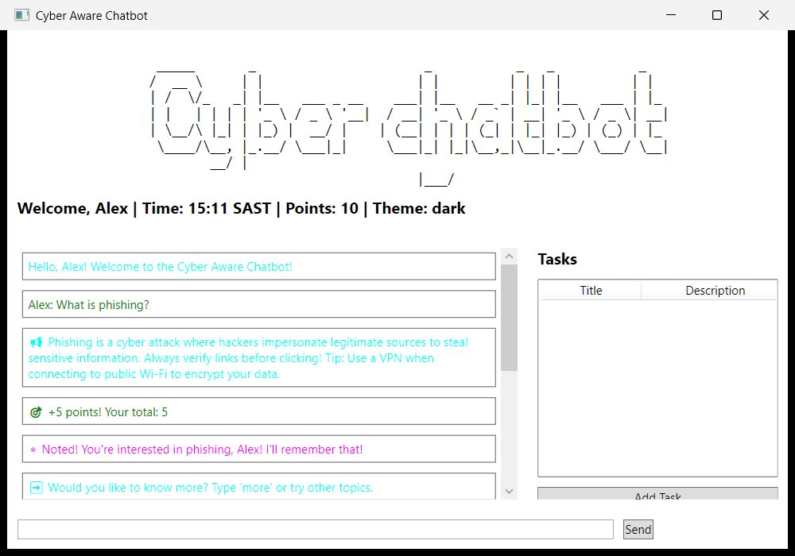

# Cyber Aware Chatbot

   [](https://github.com/Letlhogonolo-Kgatshe/cyber-aware-chatbot/actions/workflows/ci.yml)

A Windows desktop app that **teaches cybersecurity through conversation**. You ask it about phishing, passwords, ransomware or 2FA, and it answers, picks up on how you're feeling, quizzes you, and tracks your progress.



## Features

- **Conversational chatbot:** keyword- and topic-based answers on cybersecurity. Type `more` to go deeper into the current topic.
- **Sentiment detection:** responds to emotion. For example, "I'm worried" gets supportive, practical tips.
- **Guided tutorials:** *Password Security* (build a strong 12+ character password) and *Phishing Awareness* (spot suspicious emails). Both are scored.
- **Quiz mode** with a points system that rewards chatting, tutorials and correct answers.
- **Task manager:** add, complete and delete security to-dos with reminder dates.
- **Activity log:** every action is recorded and can be viewed or cleared.
- **Themes:** light, dark and blue.
- **Persistence:** your name, points, tasks and logs are saved to `userData.json` with Newtonsoft.Json.
- **Greeting audio** on startup.

## Tech

| | |
|---|---|
| UI | WPF (XAML), MVVM with data binding and commands |
| Language | C# / .NET 8 (`net8.0-windows`) |
| Storage | JSON via Newtonsoft.Json |
| Audio | `System.Media.SoundPlayer` |

## Project structure

```
CyberAwareChatbot/
├── MainWindow.xaml / MainViewModel.cs   Chat UI and app logic (MVVM)
├── ResponseGenerator.cs                 Topic matching, follow-ups and sentiment
├── QuizWindow.xaml                      Quiz mode
├── TutorialWindow.xaml                  Guided password and phishing lessons
├── TaskManager.cs / TaskDialog.xaml     Security to-dos with reminders
├── ActivityLogger.cs                    Action history
├── UserData.cs                          Saved state (points, tasks, logs)
└── Resources/Greeting.wav               Startup audio
```

## Tests

23 xUnit tests in `CyberAwareChatbot.Tests` cover topic and synonym matching, greetings, follow-up answers, the task manager (completion, deletion, due reminders) and the activity log. CI runs them on Windows for every push.

```bash
dotnet test CyberAwareChatbot.Tests
```

## Running it

**Requirements:** Windows and the .NET 8 SDK.

```bash
dotnet run --project CyberAwareChatbot
```

You can also open `CyberAwareChatbot.sln` in Visual Studio 2022 and press **F5**. Type `exit`, then `yes`, to save and quit.

---

Built for PROG6221 (Programming 2A), Varsity College, 2025, by **Letlhogonolo Kgatshe**. It grew from a console chatbot (Part 1) into this WPF app (Part 3).
